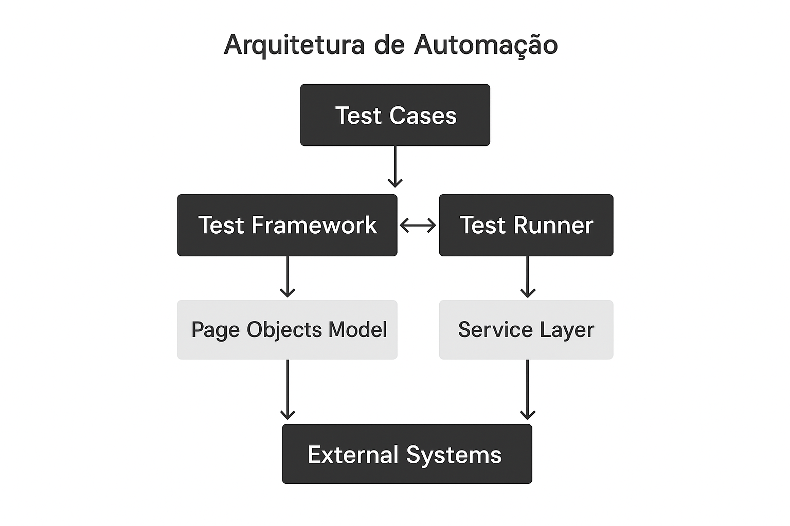

# 🤖 SDET Robot Automation Project

Projeto de automação de testes utilizando **Robot Framework**, consumindo um **framework core versionado via pip**, desenvolvido para demonstrar práticas reais de **SDET / QA Automation Engineering**.

---

## 🎯 Objetivo

Este projeto tem como objetivo demonstrar:

* Uso de **Robot Framework desacoplado** da implementação técnica
* Consumo de um **framework core reutilizável** via `pip`
* Arquitetura limpa e escalável para automação de APIs
* Boas práticas de versionamento e integração entre repositórios

O framework core utilizado neste projeto está disponível em:

👉 **sdet-python-automation-core**
[https://github.com/rftrombeta/sdet-python-automation-core](https://github.com/rftrombeta/sdet-python-automation-core)

---

## 🏗 Arquitetura da Solução de Automação



Este projeto representa a **camada de testes**, responsável apenas por:
- Orquestrar cenários
- Definir comportamento de testes
- Consumir o Automation Core via pip

### Visão Geral

A arquitetura segue princípios de:
- Separação de responsabilidades
- Reutilização
- Manutenibilidade
- Escalabilidade

### Fluxo de execução

1. Os testes são escritos em Robot Framework
2. As keywords Python são expostas pela BaseLibrary
3. A BaseLibrary delega chamadas ao Automation Core
4. O Core executa a lógica técnica (HTTP, validações, contratos)
5. O resultado é retornado de forma padronizada ao teste

---

## 🧱 Arquitetura

```text
sdet-robot-automation-project
│
├── tests/
│   └── api/
│       └── example_api.robot
│
├── pyproject.toml
├── README.md
└── .venv/
```

### 🔗 Relação entre os projetos

```text
Robot Framework Tests
        │
        ▼
SDET Python Automation Core (via pip)
        │
        ▼
HttpClient • Context • Libraries • Keywords
```

O projeto Robot **não contém lógica técnica de HTTP**, apenas consome keywords expostas pelo core.

---

## 📦 Dependências

Gerenciadas via **pyproject.toml**:

```toml
[project]
dependencies = [
  "robotframework>=6.0",
  "sdet-python-automation-core @ git+https://github.com/rftrombeta/sdet-python-automation-core.git@v0.1.0"
]
```

---

## 🚀 Instalação

### 1️⃣ Criar ambiente virtual

```bash
python3 -m venv .venv
source .venv/bin/activate
pip install --upgrade pip
```

### 2️⃣ Instalar dependências

```bash
pip install -e .
```

---

## ▶️ Execução dos testes

```bash
robot tests/api/example_api.robot
```

### ✅ Exemplo de teste

```robot
*** Settings ***
Library    sdet_python_automation_core.libraries.base_library.BaseLibrary

*** Test Cases ***
GET Example Using Core Framework
    Create HTTP Client    https://jsonplaceholder.typicode.com
    GET    /posts/1
    Status Should Be    200
```

---

## 🧠 Conceitos aplicados

* SDET Architecture
* Core framework reutilizável
* Versionamento semântico
* Integração via pip (GitHub)
* Separação entre testes e implementação

---

## 👤 Autor

**Rodrigo Trombeta**
QA SDET • Automação • IA

* LinkedIn: [https://www.linkedin.com/in/rodrigo-trombeta-21b89252](https://www.linkedin.com/in/rodrigo-trombeta-21b89252)
* GitHub: [https://github.com/rftrombeta](https://github.com/rftrombeta)

---

## 📌 Próximos passos

* Expansão de testes API
* Integração com múltiplos ambientes
* Autenticação (Bearer / OAuth)
* Integração com CI/CD
