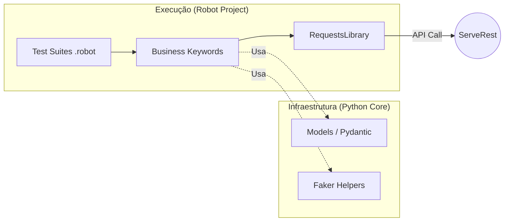

# SDET Robot Automation Project 🤖

Este repositório contém a suíte de automação de testes para a API [ServeRest](https://serverest.dev/), utilizando o **Robot Framework**. O diferencial deste projeto é a sua arquitetura desacoplada, onde a inteligência de dados é consumida de uma biblioteca core externa.

## 🏗️ Arquitetura do Projeto

Diferente de abordagens monolíticas, este projeto atua como um **cliente**, consumindo recursos de infraestrutura (Models e Helpers) do repositório [sdet-python-automation-core](https://github.com/rftrombeta/sdet-python-automation-core).

### Fluxo de Integração
O Robot Framework gerencia a orquestração dos testes e as requisições HTTP, enquanto o Core fornece a garantia de contratos e geração de massa de dados dinâmicas.



## 📁 Estrutura do Projeto

```
sdet-robot-automation-project/
├── configs/
│   └── settings.yaml          # Configurações do projeto
├── docs/                      # Documentação adicional
├── results/                   # Relatórios de execução (gerados)
│   ├── log.html
│   ├── output.xml
│   └── report.html
├── serveRest/
│   ├── resources/
│   │   ├── base.resource      # Recursos base
│   │   ├── actions/           # Ações específicas (login, usuários)
│   │   └── assertions/        # Asserções para validações
│   └── tests/
│       └── api/               # Testes da API
│           ├── login/
│           ├── produtos/
│           └── usuarios/
├── requirements.txt           # Dependências Python
├── README.md                  # Este arquivo
└── report.html, log.html, output.xml  # Relatórios na raiz (gerados)
```

## 🛠️ Tecnologias Utilizadas

- **Robot Framework**: Motor de execução de testes.
- **RequestsLibrary**: Gerenciamento de requisições HTTP/REST.
- **Python 3.9+**: Base tecnológica do ecossistema.
- **sdet-python-automation-core**: Dependência externa para modelos de dados e utilitários.

## 📋 Pré-requisitos

- Python 3.9 ou superior instalado.
- Git para clonar repositórios.
- Acesso à internet para instalar dependências.

## 🚀 Instalação e Configuração

1. **Clonar o Repositório**
   ```bash
   git clone https://github.com/rftrombeta/sdet-robot-automation-project.git
   cd sdet-robot-automation-project
   ```

2. **Configurar Ambiente Virtual (venv)**
   É altamente recomendado o uso de um ambiente isolado:
   ```bash
   # Windows
   python -m venv venv
   .\venv\Scripts\activate

   # Linux/Mac
   python3 -m venv venv
   source venv/bin/activate
   ```

3. **Instalar Dependências**
   O projeto instalará automaticamente o Core diretamente do GitHub conforme definido no `requirements.txt`:
   ```bash
   pip install -r requirements.txt
   ```

## 🧪 Executando os Testes

Você pode rodar todos os testes da pasta `tests` ou especificar uma suíte:

```bash
# Rodar todos os testes e salvar resultados na pasta 'results'
robot -d results tests/

# Rodar testes filtrando por Tags (ex: smoke)
robot -d results -i smoke tests/

# Rodar uma suíte específica
robot -d results tests/api/login/postLogin.robot
```

## 📊 Relatórios e Logs

Após a execução, o Robot Framework gera relatórios detalhados em HTML na pasta `/results`:

- **report.html**: Visão executiva dos testes.
- **log.html**: Detalhamento técnico de cada step e requisição.
- **output.xml**: Dados brutos para integração com outras ferramentas.

## 👨‍💻 Autor

Rodrigo Trombeta - [LinkedIn](https://linkedin.com/in/rodrigotrombeta) | [Portfólio](https://rftrombeta.github.io/)